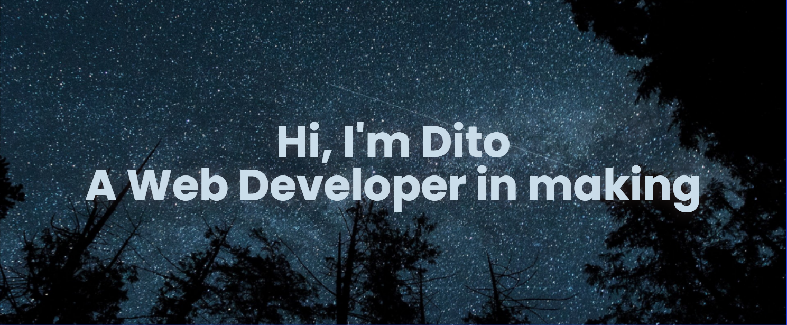

    
    
    

 
# About ME 💬 :

### - I'm 19 years Android & Web programming Enthusiast from Indonesia.

### - Learning :
- ✨ Android Programming
- ✨ Web Programming

### - Hobbies : 
- ✨ Gaming Addict
- ✨ Watching Anime
- ✨ Reading Web & Light Novels
- ✨ Badminton & Volleyball

 
 
 

<!--
**Dityaren/Dityaren** is a ✨ _special_ ✨ repository because its `README.md` (this file) appears on your GitHub profile.

Here are some ideas to get you started:

- 🔭 I’m currently working on ...
- 🌱 I’m currently learning ...
- 👯 I’m looking to collaborate on ...
- 🤔 I’m looking for help with ...
- 💬 Ask me about ...
- 📫 How to reach me: ...
- 😄 Pronouns: ...
- ⚡ Fun fact: ...
-->
